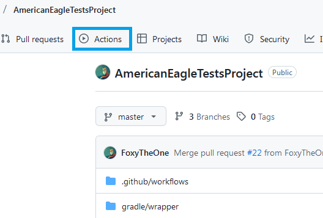
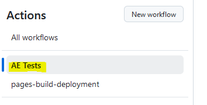
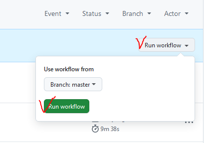
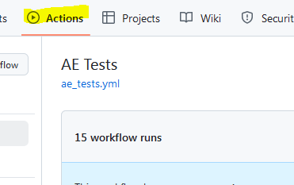
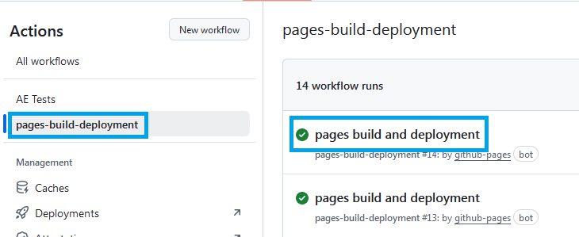
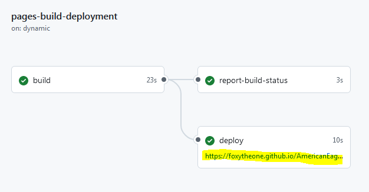
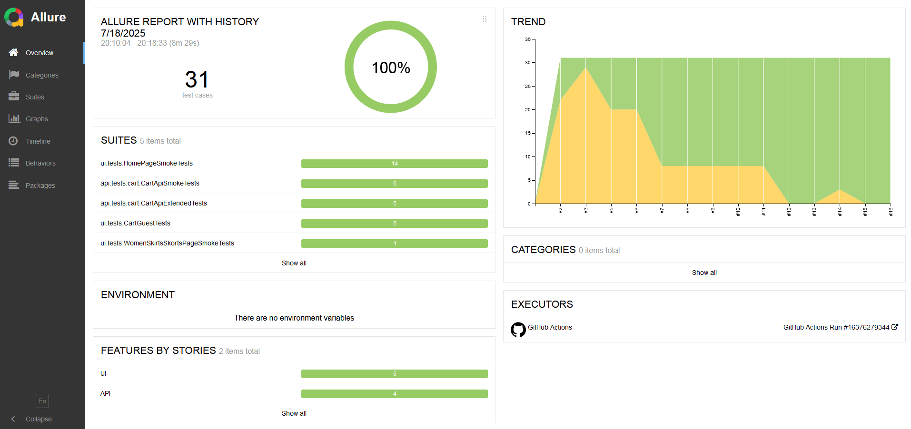
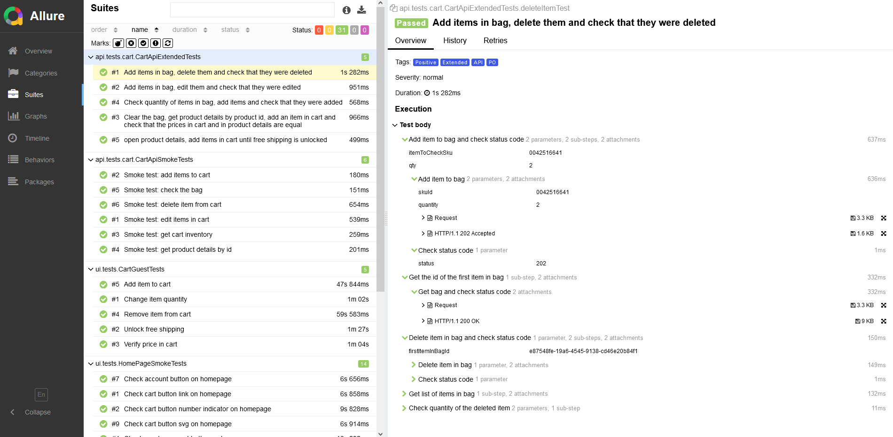

# AmericanEagleTestProject

Это репозиторий для дипломного проекта по автоматизации тестовых сценариев для сайта [American Eagle](https://www.ae.com/us/en) с использованием UI и API тестов.

## Содержание
- [🛠️ Технологический стек](#-технологический-стек)
- [🚀 Запуск тестов](#-запуск-тестов)
- [⚙️ Запуск в Github Actions](#-запуск-в-github-actions)
- [📊 Allure отчет в Github Actions](#-allure-отчет-в-github-actions)

---

## 🛠️ Технологический стек

  
  
  
  
  
  
  
  
  

- **Язык программирования:** Java 17
- **UI тестирование:** Selenium
- **API тестирование:** REST assured
- **Сборка:** Gradle
- **Тестовый фреймворк:** JUnit 5
- **Шаблон проектирования:** Page Object Model (POM)
- **Упрощение создания моделей в API тестировании:** Lombok
- **Отчетность:** Allure Report
- **CI/CD:** GitHub Actions, который создаёт Allure отчёт и публикует результаты на GitHub Pages.

**Содержание Allure отчёта:**
- Шаги тестов
- Автоматические скриншоты для упавших UI-тестов (кроме тестов с секретными данными)
- Page Source для упавших UI-тестов

---

## 🚀 Запуск тестов

Для запуска тестов с авторизацией заполните поля email и password в файле default.properties.

### Команды для запуска:

Все тесты (кроме дефектных):
`gradle allExceptDefect`

Только smoke-тесты (кроме дефектных):
`gradle smoke`

Только API-тесты (кроме дефектных):
`gradle apiTests`

Только UI-тесты (кроме дефектных):
`gradle uiTests`

Только defect-тесты:
`gradle defect`

Полный прогон всех тестов:
`gradle test`

Для удаленного запуска в GitHub Actions:
`./gradlew allExceptDefectRemote -Denv=default`

---

## ⚙️ Запуск в Github Actions
1. Перейдите в репозиторий `AmericanEagleTestsProject`  

2. Откройте вкладку `Actions`  

3. Выберите workflow `AE Tests`  

4. Нажмите `Run workflow`  

5. Дождитесь завершения выполнения

---

## 📊 Allure отчет в Github Actions
1. После завершения сборки перейдите в `Actions` снова  

2. Нажмите на `pages and deployment`  

3. Перейдите по ссылке в отчет  

4. Просмотрите отчет  
  

